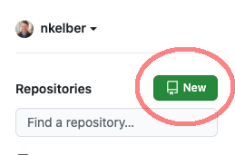
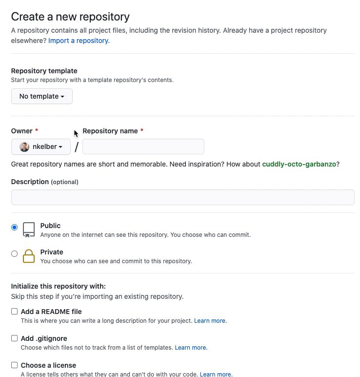

<param ve-config title="Documentation" component="default" class="documentation" fixed-header>

[<i class="fas fa-arrow-circle-left"></i> Home](/docs)

---
# Create a Repository for your Site

1. Log into your account at [github.com](http://github.com)
2. In the upper left-hand corner, click on "New" to create a new repository.

3. Create a "Repository name" without spaces.
4. Optionally, add a description.
5. Confirm that the repository is public. 
6. Check the box under "Add a README file"
7. Finally, create the repository. 

**That's it! You've created a new visual essay site!**

# Viewing your Site

Your current visual essay site is based on a single document: README.md. The address for your website is based on the following construction:

> http://visual-essays.app/your-github-username/your-repo-name

Simply, fill in your own github user name and the name you used for your repository. For the next step, we will add some content using Markdown.

**Note:** It is possible to render your site on a custom domain. Contact us for direction here.

---
[<i class="fas fa-arrow-circle-left"></i> Home](/docs) | [An Introduction to the Visual Essay Tool <i class="fas fa-arrow-circle-right"></i>](/docs/authoring-intro)
