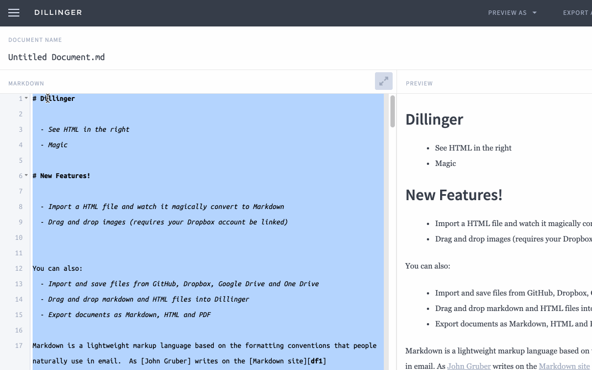
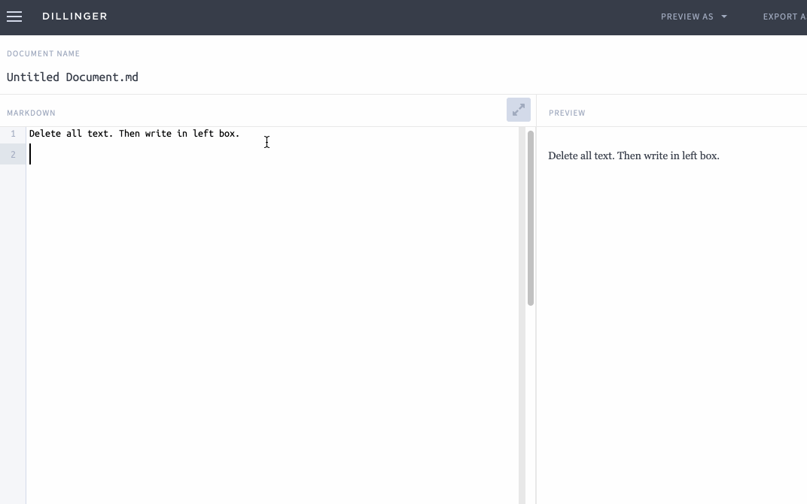
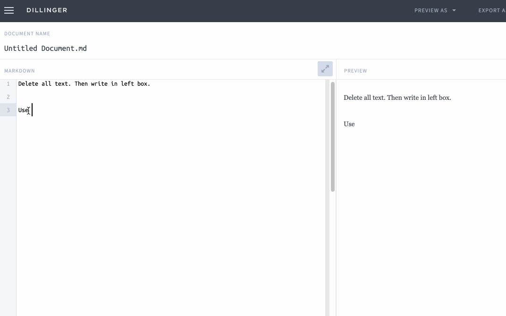
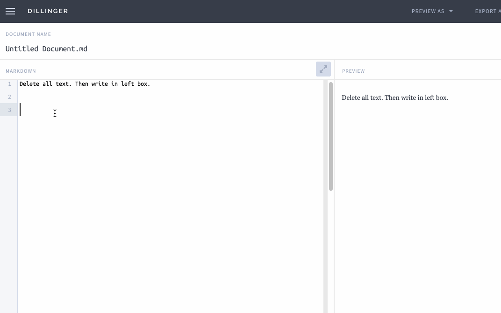
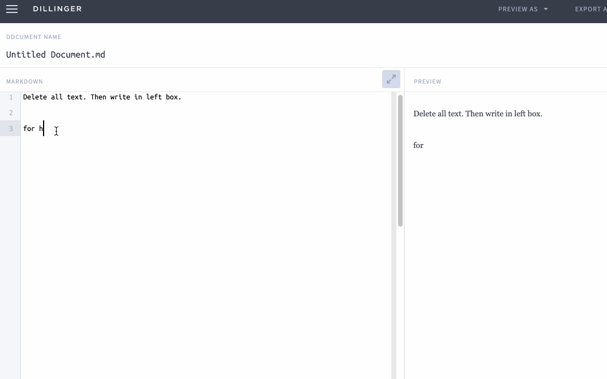
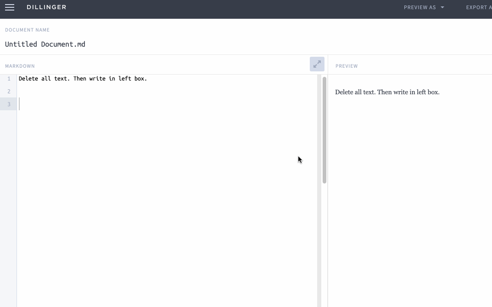
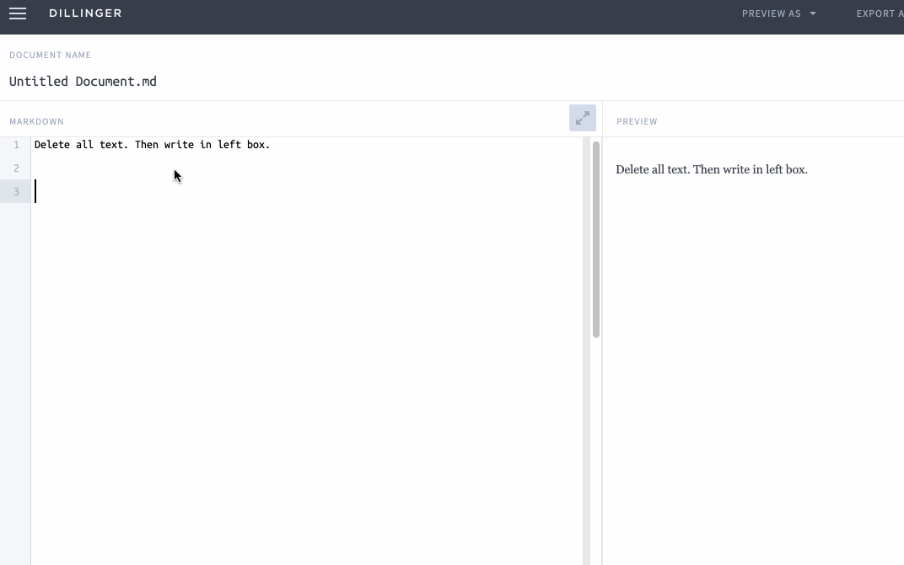
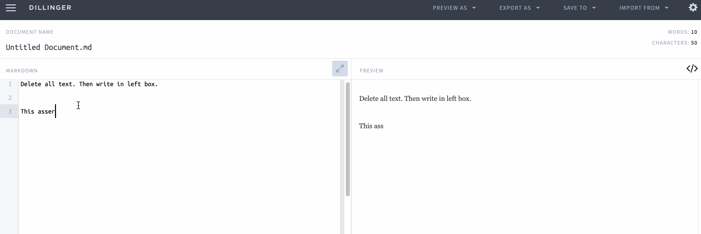

<param ve-config title="Documentation" component="default" class="documentation" fixed-header>

[<i class="fas fa-arrow-circle-left"></i> Home](/docs) <br />
[Viewing Your Writing in a Markdown Editor](#viewing-your-writing) <br />
[Create Headers/Titles](#headers) <br />
[Add Emphasis with Italic and Bold](#emphasis) <br />
[Create Lists (Bulleted and Numbered)](#lists) <br />
[Create Hyperlinks](#links) <br />
[Insert Images](#images) <br />
[Insert a Horizontal Rule/Dividers](#dividers) <br />
[Insert footnotes](#footnotes) <br />
[Print your own Markdown Cheat Sheet](#print-your-own) <br />
[Creating and Editing Pages in GitHub <i class="fas fa-arrow-circle-right"></i>](/docs/create-and-edit-pages/)
___

# Learn Markdown in 30 Minutes

Markdown is a simple way to format text. It allows you to mark text, so that it has basic formatting. In this short tutorial, we'll show you how to use markdown to do the following:

# Viewing Your Writing in a Markdown Editor
<param id="viewing-your-writing">

In this quick lesson, we'll use a free online Markdown Editor called [Dillinger](http://dillinger.io). (You could also use another editor such as [StackEdit](http://stackedit.io) or [Editor.md](https://pandao.github.io/editor.md/en.html). Whatever editor you choose, the editor will display the original text that you edit on the left and preview the transformed text (as it would appear in a web browser) on the right side. Select all the text in the Markdown box on the left and delete it so we can start with a fresh slate. Try creating each of these in your editor!



# Create Headers/Titles
<param id="headers">

A header is text that starts a new section, like a title. To create a large header, simply insert a hashtag (#) in front of the title. You can use additional hashtags for smaller headers. These are useful for creating sub-sections of a larger document. 

```html
# Example Header
```



# Add emphasis with Italic and Bold
<param id="emphasis">

Italicize words by adding a single asterisk or underscore on each side.
```html
*italic text*
``` 
or 
```html
_italic text_
```

Bold words by adding two asterisks or two underscores on each side.
```html
**bold text**
```
or 
```html
__bold text__
```



# Create lists (Bulleted and Numbered)
<param id="lists">

Create a bulleted list using asterisks. Create a numbered list using numbers followed by periods.

```html
* Bullet item 1
* Bullet item 2
* Bullet item 3

1. Numbered item 1
2. Numbered item 2
3. Numbered item 3
```



# Create hyperlinks
<param id="links">

Create hyperlinks by putting the link text in brackets and the link address in parentheses. 
```html
Check out [JSTOR Labs](http://labs.jstor.org)
```



# Insert images
<param id="images">

Insert images by starting with an exclamation point, followed by an image description for accessibility in brackets, and finally put the address where the image is stored on a server into a set of parentheses.
```html

```



# Insert a Horizontal Rule/Divider<a name="dividers"></a>

Insert a horizontal rule by writing three underscores, asterisks, or hyphens in a row.
```html
***
---
___
```



# Insert Footnotes
<param id="footnotes">

Add a footnote by putting a caret followed by a number in a set of brackets. The number will turn into a hyperlink that brings readers to the appropriate footnote at the bottom of the page.

At the bottom of the page, write the same footnote construction (a caret followed by a number in brackets) then a colon. Any text written after that will appear in the footnote at the bottom of the page. In this example, our footnote is a hyperlink to an article in *The Wall Street Journal*.
```html
This needs some evidence. [^1]

[^1]: See the work of Dr. Pepper for more information.
```




# Print your own Markdown Cheat Sheet
<param id="print-your-own">
If you find yourself forgetting how to do something in markdown, there are many markdown cheatsheets available on the web. Here is [one you can print out](https://guides.github.com/pdfs/markdown-cheatsheet-online.pdf) and keep handy.

___

[<i class="fas fa-arrow-circle-left"></i> Home](https://docs.visual-essays.app/) | [Creating and Editing Pages in GitHub <i class="fas fa-arrow-circle-right"></i>](/docs/create-and-edit-pages/)
