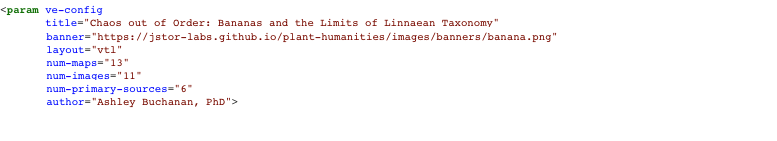
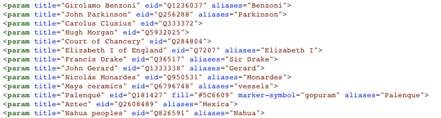
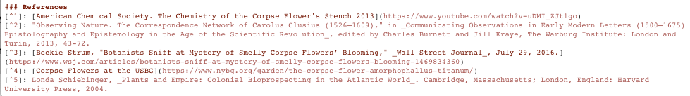

<param ve-config title="Documentation" component="default" class="documentation" fixed-header>

#
<param class="nav">

[<i class="fas fa-arrow-circle-left"></i> Home](/docs)  
[The Configuration Tag](#config-tag)  
[Linked Data Entity Tags](#linked-data-tag)  
[Body](#body)  
[References](#references)  
[Adding Images to your Site <i class="fas fa-arrow-circle-right"></i>](/docs/create-images)
____

# The Parts of a Visual Essay

Essays written for print have familiar parts, such as:

* A Title
* An Author
* A description or abstract
* Sections
* Paragraphs
* Footnotes/Endnotes/References

All of those parts can also be found in visual essays, but visual essays might also include features such as:

* Images and Image Galleries
* Maps and Layers
* Linked Open Data
* Network Graphs

To create these features, a visual essay depends on some level of coding that describes for readers what should appear on the screen at any given time. Our goal in creating the Visual Essay Tool has been to balance the performative possibilities of your essay with the complexity of code. In doing so, we have sought to tuck code under the hood that the average scholar may find overwhelming—yet sufficiently expose the levers and buttons that are likely to help make sophisticated arguments. We create this balance—between accessibility and complexity—from author feedback. So please reach out if you feel like we're holding you back!

The structure of a visual essay is very similar to a traditional printed essay. They begin with descriptive data, transition into the argument body, and end with references. Here are the parts you can expect to see in the order they appear:

1. **Configuration Tag** Contains basic information about the essay such as title, author, and visual features
2. **Linked Data Tags** The concepts in the essay that have linked open data attached to them.
3. **Body** The main text of the essay broken up into sections by headings. Each heading can have visualizations attached such as images and maps. When the reader scrolls to the next heading, the visualizations are automatically replaced.
4. **References** The final section containing all the footnotes for the essay. These footnotes could be in any citation format and may include direct links to other sources.

# The Configuration Tag
<param id="config-tag">

The `param ve-config` tag is not technically required for an essay to render, but it supplies crucial information that any serious essay would include. The form of the configuration tag is:

```html
    <param ve-config attribute="value for this attribute">
```

Note that the tag begins with a left caret (<) and ends with a right caret after the final attribute (>). (If you're familiar with HTML, you might also note that there is no closing tag.) The `<param ve-config>` can contain multiple attribute/value pairs. Each attribute can be spaced out on a single line, but they are often clearer when formed into a vertical list like so:



The value for a given attribute is always enclosed in double quotations marks ("). In this example we can see the following *attributes* are defined for this essay:

|Attribute|Description|Effect for Readers|
|---|---|---|
|title|The title of your essay|Displayed at the top of your essay|
|banner|The URL of your banner image|Displayed at the top of your essay|
|layout|Specify a vertical essay with `vtl`|Your essay will use a vertical orientation|
|author|That's probably you!|Displayed at the top of your essay|

# Linked Data Entity Tags
<param id="linked-data-tag">

After the initial configuration, a visual essay will often contain a list of linked data tags. These linked data entity tags enable the most powerful features of visual essay writing, making it possible for authors to quickly generate:

* Background information for readers about a person, concept, or place 
* Maps that show spatial relationships
* Network Graphs
* Galleries of images
* Tables of data
* Timelines

To accomplish these, a linked entity tag connects an object or concept from your essay to a graph network. The default for the Visual Essay Tool is Wikidata. This connection is accomplished through the use of special identifier for items. For example, the item identifier for the city of Detroit is Q12439. We can see the available by examining the [Detroit Wikidata page](https://www.wikidata.org/wiki/Q12439). The information is quite expansive, describing the city's name in many languages, it's nicknames, images of the city, its location, founding date, its motto, flag, seal, and more. Later, we'll show how to retrieve some of this data and populate it in your essay. 

For now, it is worth knowing that linked data entity tags are often declared before the body of the essay. Your essay might have dozens of linked data entity tags listed before the body the essay. If a linked data entity tag is declared before the body section of the essay begins, it will be accessible in *every* section of the essay. For example, you could have a map showing the location of Detroit shown every time the word Detroit is mentioned. The Visual Essay Tool is even smart enough to recognize Detroit by a nickname, such as "The Motor City". It's also possible for an entity to be declared in a single section of your essay. For example, if you wrote an essay section focusing on the Chicago, you might not want the map displayed in that section to also show Detroit. 

Generally, the list of linked data entity tags are added above the body while (or sometimes after) it is drafted. Linked entity data tags have this form:

```html
   <param title="name-used-in-essay" 
          eid="digital-identifier-number" 
          aliases="other-names-used-in-essay">`
```



Occasionally, you may also see an entity tag include attributes such as `fill` and `marker-symbol`. These are used to describe the color and form of map markers. These attributes are described in more detail in the mapping section.

|Attribute|Description|Effect for Readers|
|---|---|---|
|title|A name, purely for the reference of the essay writer|No effect for readers, just helps the writer remember the entity since an identifier number is opaque|
|eid|The linked data identifier|Triggers different effects when the identifier is mentioned in the text depending on whether it is person, place, thing, concept, etc.|
|aliases|other names for the item|These additional names also trigger effects beyond the alternative names listed in the Wikidata entry. So you could add "Arsenal of Democracy" for an alias of Detroit even though it is not in the Wikidata entry.|
|fill|The color of map marker described using a color hex code|Readers will see a marker of this entity on maps in the chosen color|
|marker-symbol|The symbol used on a map for that entity|Readers will see that entity in the location where the entity is on the map according to Wikidata.|

# Body
<param id="body">

The body of a Visual Essay is composed of sections, where each section is denoted by a new heading such as:

`# The 20th Century`

In order for the heading to render properly (and therefore for the section to be created), there must be a space after the hashtag(s) and before the heading text. A section can contain a single paragraph or many paragraphs. They can also include subsections using an additional hashtag such as:

`## The 1920s`

The concept of a section is important, not just for guiding readers, but for determining what will be displayed in the right pane of the Visual Essay. When a reader approaches the next section in a text, a new visualization automatically populates the right pane of the Visual Essay. For example, the right pane may change from a gallery view of documents to a map or a network graph. Writers should carefully consider what content might be most useful for the readers in any given section.


# References
<param id="references">

The final section of a visual essay contains any academic references. From a print perspective, these serve the same purpose as footnotes connecting readers to additional text (and sometimes resources) that are significant for research purposes but were not able to be included in the main body. A footnote is inserted into the body of the text using the basic form:

`This assertion has been proven by other researchers.[^ref1]`

Additional footnotes can be included simply by incrementing the number to `[^ref2]`, `[^ref3]`, and so on. This will create a small link in the text in the form of a matching superscript number. If the reader clicks on that number, it will take them to reference at the bottom of the page.

The Reference is a distinct section, so it must begin with a new heading. The title is usually "References" but it could be "Footnotes" or some other name. 

For each reference in the body, a corresponding reference is placed in the final references section that takes the form:

`[^ref1]: See also the research of Smith, James, and Royster.`

The only difference from the reference in the body is the inclusion of a colon. References can simply point to print sources, but they may also include links to online articles, videos, images, and other materials.

 

___
[<i class="fas fa-arrow-circle-left"></i> Home](/docs) | [Adding Images to your Site <i class="fas fa-arrow-circle-right"></i>](/docs/create-images)
