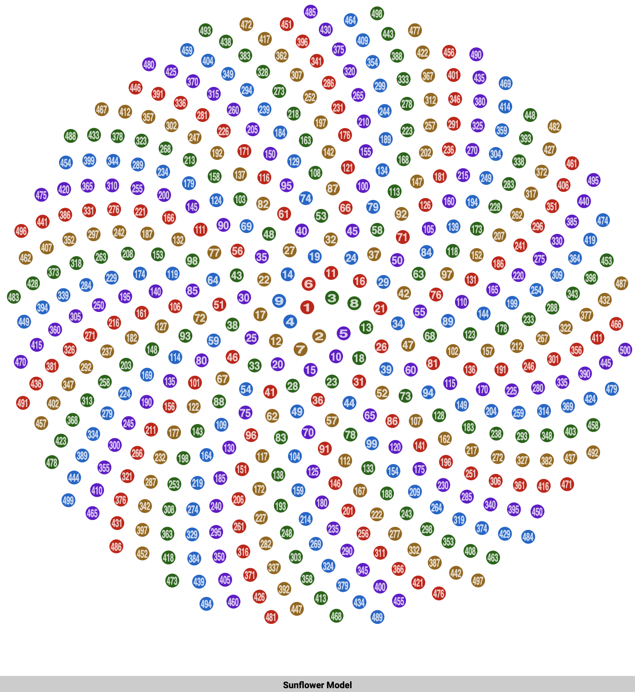

<param ve-config title="Documentation" component="default" class="documentation" fixed-header>

# Graphic viewer

## Overview
{: .right .dropshadow .border .thumb-300w} 
The Graphic viewer is used to display images, GIFs, and SVGs. This component is used to display graphics that do not require IIIF capabilites. 

## Options
- __img__:  The URL or relative path to a graphic file.
- __title__: The title attribute is used for the caption.

## Usage examples
`<param ve-graphic img="https://upload.wikimedia.org/wikipedia/commons/a/ad/SunflowerModel.svg">`
