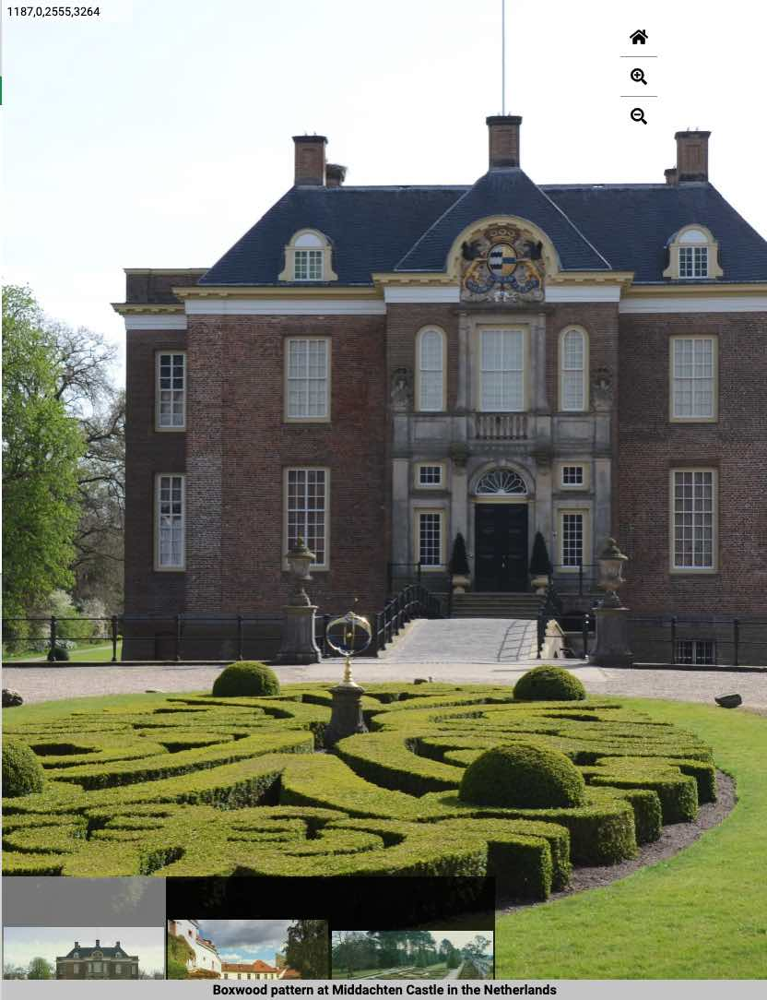

<param ve-config title="Documentation" component="default" class="documentation" fixed-header>

# Image viewer

## Overview

{: .right .dropshadow .border .thumb-300w} 

The image viewer is used to display high-resolution images with interactive zooming and panning.  Images are rendered in a custom IIIF viewer that provides many options for image display and interaction, including a guided tour capability using annotations.  The [International Image Interoperability Framework (IIIF)](https://iiif.io/) is a set of standards (or application programming interfaces) that provide a standardized method for describing and delivering images over the internet.  The IIIF Presentation API defines a manifest that links to an image service and defines image metadata, including an image label, description, attribution statement, license, and other custom metadata deemed useful or important by the manifest creator.

The visual essays image viewer is able to both use an existing IIIF manifest (such as those made available by a number of museums, libraries, and other image archives) and dynamically created manifests using attributes defined in a visual essay `ve-image` tag.


## Options

- __manifest__:  The URL to an existing IIIF presentation manifest for the image, if one exists.
- __url__:  The URL to the image file.  This is not required or used if a __manifest__ option is provided. When using a IIIF image separate from a manifest, `/info.json` must be appended to the image URL. When using an image URL the highest quality version of the image should be used when multiple versions are available, such as when using a Wikimedia Commons image.
- __label__:  The label attribute is used for the image caption.  Markdown text formatting is supported in the title allowing for italicized and bold text.
- __description__:  If a label is not provided the attribute is used for the image caption.  Markdown text formatting is supported in the title allowing for italicized and bold text.
- __attribution__:  An attribution statement to associate with the image.
- __license__:  Where possible, this should be a Creative Commons license tag or URL.  For example, "CC0", "BY", "BY-SA", https://creativecommons.org/licenses/by/4.0/, etc.  The Creative Commons [Share your work](https://creativecommons.org/share-your-work/) page provides a helpful tool for selecting an appropriate license to use for contributed content.
- __fit__:  This attribute defines how an image will be scaled or cropped in the image viewer window.  Possible values for this attribute are
    -  `contain`:  The replaced content is scaled to maintain its aspect ratio while fitting within the element's content box
    -  `cover`:  (default) The replaced content is sized to maintain its aspect ratio while filling the element's entire content box. The object will be clipped to fit
- __rotate__:  
- __region__:  The region attribute is used to show a cropped region of the image in the image viewer.  The entire image is loaded and can be seen by zooming and panning but the initial display will only include the specified region.  The value for a region is a comma separated sequence of 4 integers representing the origin, width and height.  The origin includes both the x and y coordinates relative to the top left of the image.  The region may be expressed as absolute pixel values or as percentages of the relative values.  More information on IIIF regions can be found at [https://iiif.io/api/image/2.0/#region](https://iiif.io/api/image/2.0/#region)
- __layers__:  A multi-image viewer mode that superimposes one image over another with an opacity slider.  This mode is activated by including `layers` or `layers="true"` on the first `ve-image` tag when multiple images are associated with an element.
- __curtain__:  A multi-image viewer mode that overlays one image over another with a curtain slider.  This mode is activated by including `curtain` or `curtain="true"` on the first `ve-image` tag when multiple images are associated with an element.
- __compare__:  A multi-image viewer mode that simultaneously displays multiple images in the viewer pane.  This mode is activated by including `compare` or `compare="true"` on the first `ve-image` tag when multiple images are associated with an element.
- __ref__: A reference ID (numerical integers) that is used to identify images when multiple are present in one viewer. This is used when a specific image or specific image and region needs to be shown when specified text is clicked. 

### Interactions

Image animations can be triggered by user interactions performed in the essay text pane.  Clicking or hovering over linked text can be used to zoom to a specific image region or activate the annotation viewer.  Below are some examples of interactions.

- __zoomto__:  The `zoomto` action takes 3 different possible input values:
	- a comma-delimited value defining the image region to be displayed in the viewer. The value is the same as defined in the `region` attribute above. This will default to zoom to the first image if multiple images are present. For example: `"100,100,1000,1000"`.
	- an integer number that corresponds to a `ref` ID attribute for a specific image. For example: `"1"`.
	- an integer number that corresponds to a `ref` ID attribute for a specific image and a comma-delimited value defining the image region separated by the `|` character. This will zoom to the region of a specific image when multiple images are present. For example: `"2|100,100,1000,1000"`.
	- The key word `next`. If multiple images are present, this will display the next image in the viewer.
	- The key word `previous`. If multiple images are present, this will display the previous image in the viewer.

Below are some examples of the `zoomto` action for a `click` event:  

This will zoom to the specified region (of the first image if there are multiple images).
```html 
	<span data-click-image-zoomto="100,100,1000,1000">Foo Text</span>
```

This will display the image with the `ref` attribute equal to `3`.
```html
	<span data-click-image-zoomto="3">Foo Text</span>
```

This will zoom to the specified region in the image with the `ref` attribute equal to `2`.
```html 
	<span data-click-image-zoomto="2|100,100,1000,1000">Foo Text</span>
```

This will display the next image in the viewer, if there are multiple images.
```html 
	<span data-click-image-zoomto="next">Foo Text</span>
```

## Usage examples
```html
<param ve-image
	title="Image comparison of the canopy of a dragon tree (_Dracaena draco_) with a classical Greek depiction of the dragon Ladon."
	url="https://free.iiifhosting.com/iiif/7e103f8b67bc1ce1be0a738a6a34265de93fe18ad5978f48c076da1da1fbf636/info.json"
	curtain="true"
	fit="contain"
       	ref="1" >
```
