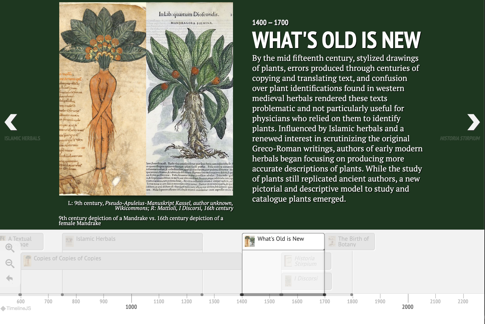

<param ve-config title="Documentation" component="default" class="documentation" fixed-header>

# Knightlab Timeline Viewer

## Overview
{: .right .dropshadow .border .thumb-300w} 
The Knightlab Timeline Viewer is used to associate and display a timeline visual with a text element. The timeline is generated by the user using a Google spreadsheet that is then processed by the Knight Lab service, which can be found at: [https://timeline.knightlab.com](https://timeline.knightlab.com). Knight Lab utilizes TimelineJS, an open-source tool that enables anyone to build visually rich, interactive timelines to generate the timeline visual. The steps to create the timeline source ID that is used in this visual essay tag can be found on the Knight Lab Timeline website at: [https://timeline.knightlab.com/#make](https://timeline.knightlab.com/#make).

## Syntax
```html
<param ve-knightlab-timeline>
```

## Options
- __source__:  The source ID of the timeline generated on Knight Lab.
- __timenav-position__:  The display position of the scrollable navigation on the timeline. The options are top or bottom.
- __hash-bookmark__:  Default is false. If set to true, TimelineJS will update the browser URL each time a slide advances, so that people can link directly to specific slides.
- __initial-zoom__:  The position in the zoom_sequence series used to scale the Timeline when it is first created. Takes precedence over scale_factor.
- __height__:  The height of the timeline.

More documentation on TimelineJS options can be found here: [https://timeline.knightlab.com/docs/options.html](https://timeline.knightlab.com/docs/options.html).

## Usage examples
```html
<param ve-knightlab-timeline source="1mlXQQ3VKfeYznV2VktShOQd2-7aH5p52_n20LQ1U0uE" timenav-position="bottom" hash-bookmark="false" initial-zoom="1" height="640">
```
