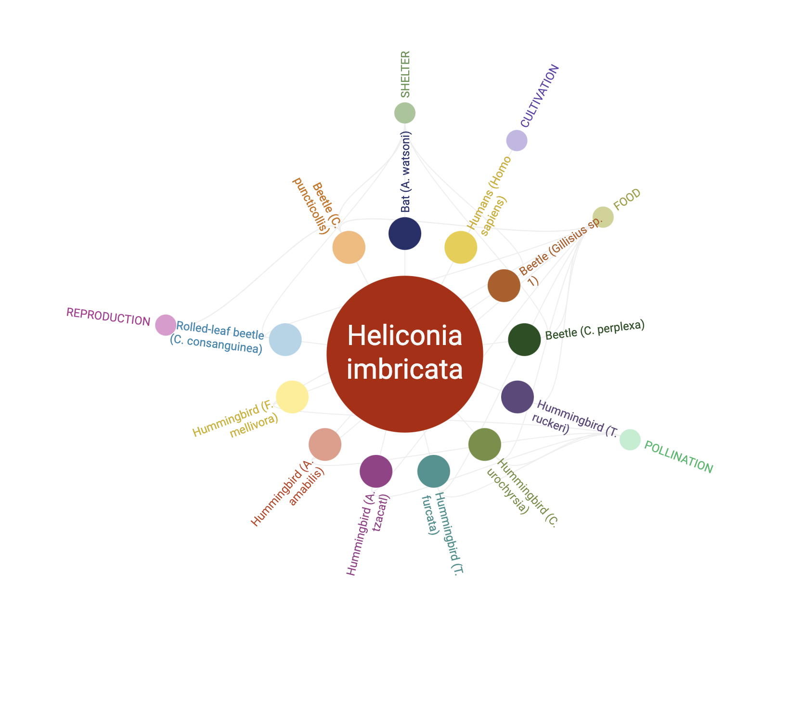

<param ve-config title="Documentation" component="default" class="documentation" fixed-header>

# Network viewers

The network viewer is used to associate and display a network graph with a text element. There are 3 different types of network graphs available:

* [D3Plus Simple Network](#d3plussimple)
* [D3Plus Ring Network](#d3plusring)
* [Vis.js Network](#visjs)

___


## D3Plus Simple Network
<a name="d3plussimple"></a>

### Overview
{: .right .dropshadow .border .thumb-300w} 

This tag renders a basic network diagram using the D3Plus library. D3plus is a JavaScript re-usable chart library that extends the popular D3.js to enable the easy creation of visualizations.  Example diagrams can be seen at [https://d3plus.org/examples/](https://d3plus.org/examples/).  Documentation is available at [https://d3plus.org/docs/](https://d3plus.org/docs/). The `ve-d3plus-network` tag is used to generate this diagram and currently supports comma separated (CSV) or tab separated (TSV) delimited text files as input data. 

### Options
- __url__: url to the input data file

### Usage examples
The data used in this example is defined in a TSV (tab separated values) file that can be seen at [https://github.com/JSTOR-Labs/plant-humanities/blob/master/graphs/medici.tsv](https://github.com/JSTOR-Labs/plant-humanities/blob/master/graphs/medici.tsv).
```html
<param ve-d3plus-network url="https://jstor-labs.github.io/ve-components/public/data/medici.tsv">
```

___


## D3Plus Ring Network
<a name="d3plusring"></a>

### Overview
{: .right .dropshadow .border .thumb-300w} 

This tag renders a ring network diagram using the D3Plus library. Rings are a way to view network connections focused on 1 node in the network.  This visualization shows primary and secondary connections of a specific node, and allows the user to click on a node to recenter the visualization on that selected node. The `ve-d3plus-ring` tag is used to generate this diagram and currently supports comma separated (CSV) or tab separated (TSV) delimited text files as input data. It also uses a `center` attribute to identify the name of the network'ss central node.

### Options
- __url__: url to the input data file
- __center__: name of central node in network

### Usage examples
This example uses the same TSV input file used in the simple network example above.
```html
<param ve-d3plus-ring-network 
       url="https://jstor-labs.github.io/ve-components/public/data/medici.tsv"
       center="Anna Maria Luisa de' Medici">
```

___


## Vis.js Network
<a name="visjs"></a>

### Overview
{: .right .dropshadow .border .thumb-300w} 

This tag renders a network diagram using the Vis.js library, a dynamic, browser based visualization JavaScript library. Examples of network graphs created in Vis.js can be seen at [https://visjs.github.io/vis-network/examples/](https://visjs.github.io/vis-network/examples/). The documentation for networks can be viewed at [https://visjs.github.io/vis-network/docs/network/](https://visjs.github.io/vis-network/docs/network/). The `ve-vis-network` tag is used to generate this graph and currently supports comma separated (CSV) or tab separated (TSV) delimited text files as input data. An optional `title` attribute can be defined to give the network graph a title. 

### Options
- __url__: url to the input data file
- __title__: title of network graph

### Usage examples
The data file used in this example can be viewed at [https://jstor-labs.github.io/plant-humanities/graphs/heliconia-v3.tsv](https://jstor-labs.github.io/plant-humanities/graphs/heliconia-v3.tsv).
```html
<param ve-vis-network title="Heliconia imbricata and hummingbird mutualistic interactions" url="https://jstor-labs.github.io/plant-humanities/graphs/heliconia-v3.tsv">
```

