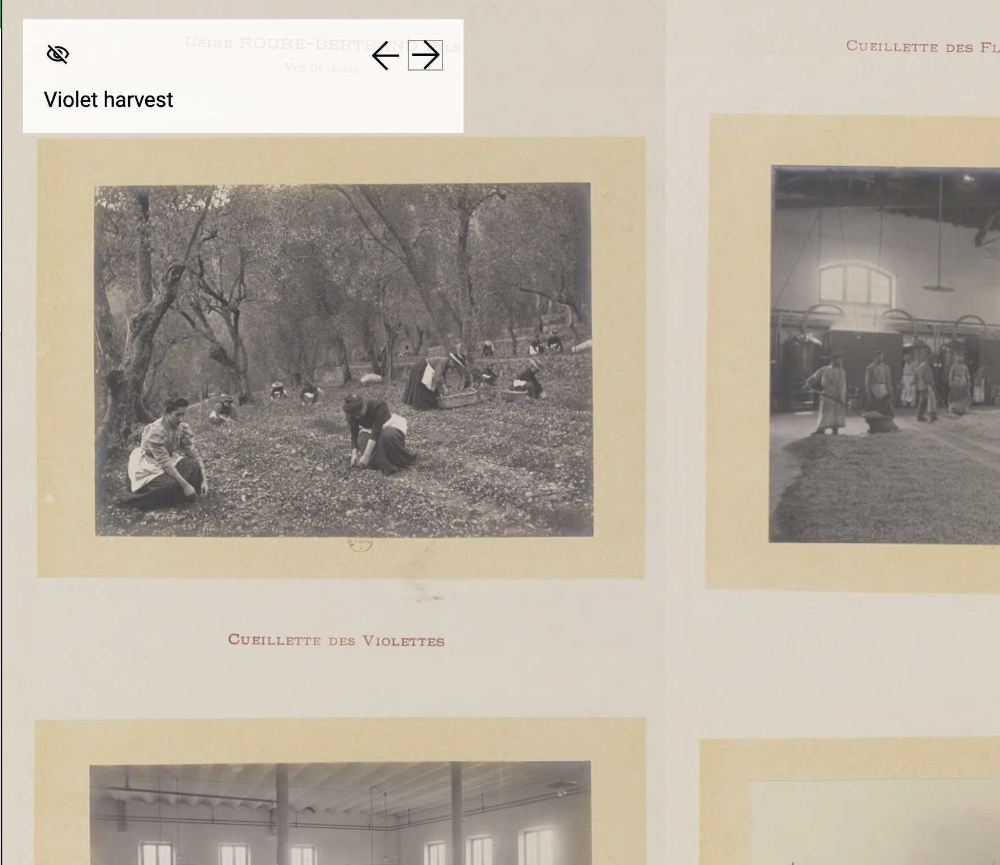

<param ve-config title="Documentation" component="default" class="documentation" fixed-header>

# Storiiies Viewer

## Overview
{: .right .dropshadow .border .thumb-300w} 
The Storiiies viewer is used to display high-resolution, annotated [IIIF](https://iiif.io/) images using [Storiiies](https://storiiies.cogapp.com/), a digital storytelling platform. Storiiies allows the user to associate text annotations to regions of an image and order them to guide the viewer to different areas of the image in the desired sequence. Examples of Storiiies images and storytelling can be found here: [https://storiiies.cogapp.com/#examples](https://storiiies.cogapp.com/#examples). The user generates a story or annotated image using the Storiiies tool, found here: [https://storiiies-editor.cogapp.com/](https://storiiies-editor.cogapp.com/). The ID from the generated Storiiies story is used in the visual essay tag.

## Syntax
```html
<param ve-storiiies>
```

## Options
- __id__:  The Storiiies story ID.
- __title__:  The title of the story or image.

## Usage examples
```html
<param ve-storiiies id="a11gl" title="Moche Stirrup-Spout Bottle, Cassava">
```
