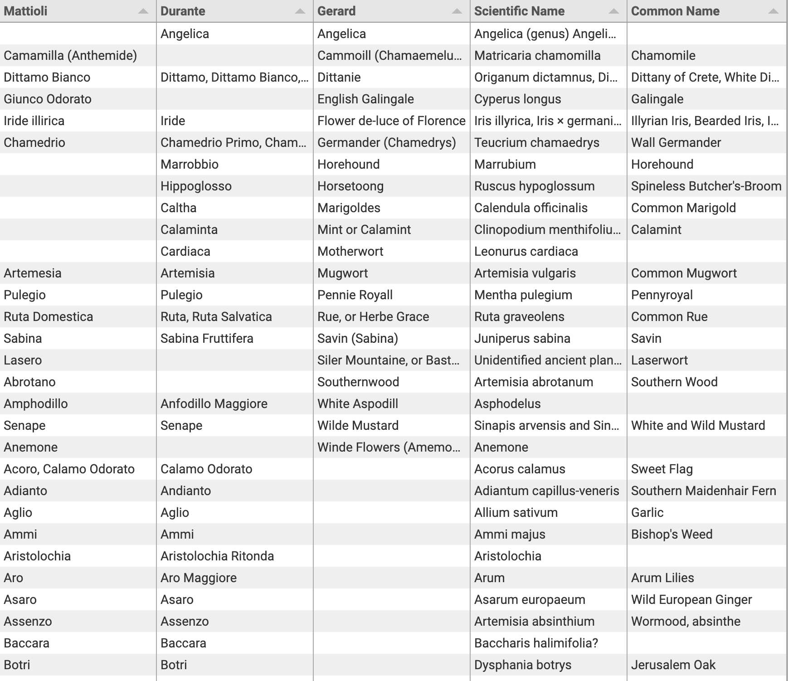

<param ve-config title="Documentation" component="default" class="documentation" fixed-header>

# Tabular data viewer

## Overview
{: .right .dropshadow .border .thumb-300w} 
The Tabular data viewer is used to display a table of data with a text element. The `ve-tabulator` tag is used to generate this table and currently supports comma separated (CSV) or tab separated (TSV) delimited text files as input data.

## Syntax
```html
<param ve-tabulator>
```

## Options
- __url__:  The url to the data file

## Usage examples
The data used in this example is defined in a TSV (tab separated values) file that can be seen at [https://github.com/JSTOR-Labs/plant-humanities/blob/develop/data/Emmenagogic_Herbs.tsv](https://github.com/JSTOR-Labs/plant-humanities/blob/develop/data/Emmenagogic_Herbs.tsv).
```html
<param ve-tabulator url="https://raw.githubusercontent.com/JSTOR-Labs/plant-humanities/develop/data/Emmenagogic_Herbs.tsv">
```
